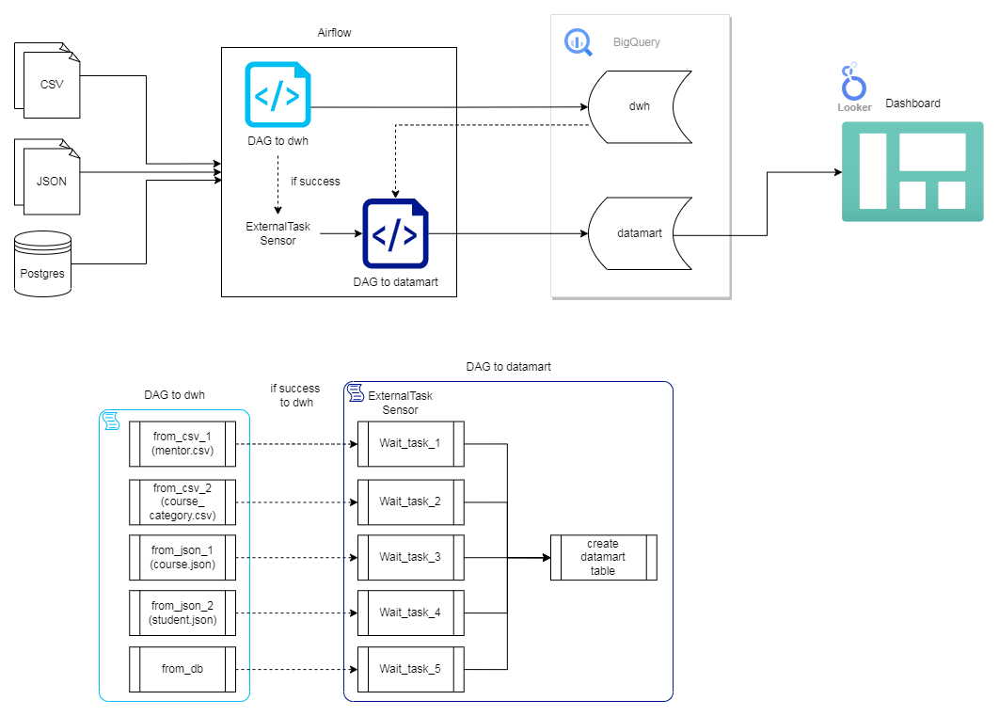

# Capstone Project Brief Data Engineering Team D ("The Future")

## Constraints

- Separate data comes from multiple sources such as databases, CSV and JSON.
- Constraints for each problem will be specifically defined in the project description section.

## About the Project

### Background
An edu-tech platform called "pinter-skuy" provides online courses facilitated by professional mentors, and anyone can enroll in these courses. As the business gains momentum, the management level aims to conduct monitoring and evaluation of their online courses.

Therefore, the information that has been stored in different sources to date is intended to be consolidated into a **_single source of truth_** for subsequent analysis.

## Tools and Framework


## ERD


## Flowchart Project


## Running Project
```
git clone https://github.com/rifa8/capstone-project-with-dynamic-dag
```

```
docker compose up -d
```

Then open `localhost:8080` to access Airflow.
```
Username: airflow
Password: airflow
```


Next, set up connections in Airflow. Go to `Admin >> Connections` in the Airflow UI, then add a connection. In this project, there are 2 connections, `to_bq` for connecting to BigQuery and `pg_conn` for connecting to the PostgreSQL database.


Then run the DAG.

TIPS: Let the DAG run according to the schedule. Do not manually run the DAG so that the ExternalTaskSensor can activate automatically.

First, activate the DAG `dag_etl_to_dwh` and wait until its status is success. After that, activate the DAG `dag_etl_to_datamart` and the `ExternalTaskSensor` will run automatically because the task status in the DAG `dag_etl_to_dwh` is already success, as specified in the script for dag_etl_to_datamart, `allowed_states=['success']`.
```
task_wait_ext_task = ExternalTaskSensor(
    task_id=f"wait_{ext_task_depen['dag_id']}_{ext_task_depen['task_id']}",
    external_dag_id=ext_task_depen['dag_id'],
    external_task_id=ext_task_depen['task_id'],
    allowed_states=['success'],
    execution_delta=timedelta(minutes=ext_task_depen['minutes_delta'])
                )
```


Check tables in BigQuery

Dataset dwh


Dataset datamart


To view the visualization results [(dashboard)](visualization/Project-Team-D.pdf), you can also access the following link: [Looker Studio](https://lookerstudio.google.com/reporting/7b4f543d-1a82-4d73-a124-0cfb29a7e5a9/page/h81mD)

## Author
- Yoga Martafian [](https://github.com/artasaurrus)

- Karno [](https://github.com/Karnopunta)

- Muhammad Rifa [](https://github.com/rifa8)
