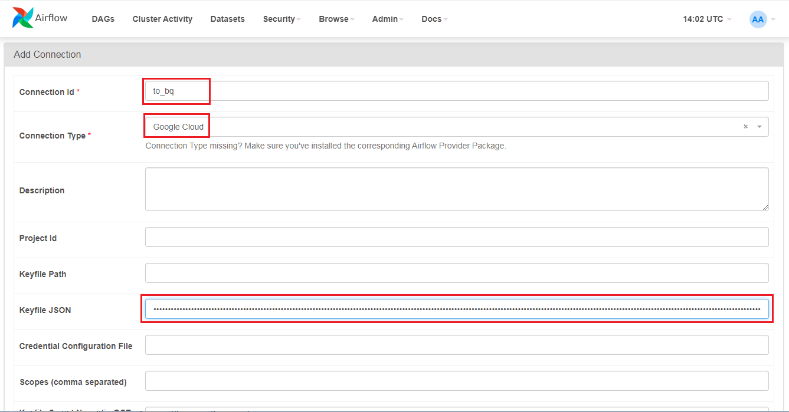
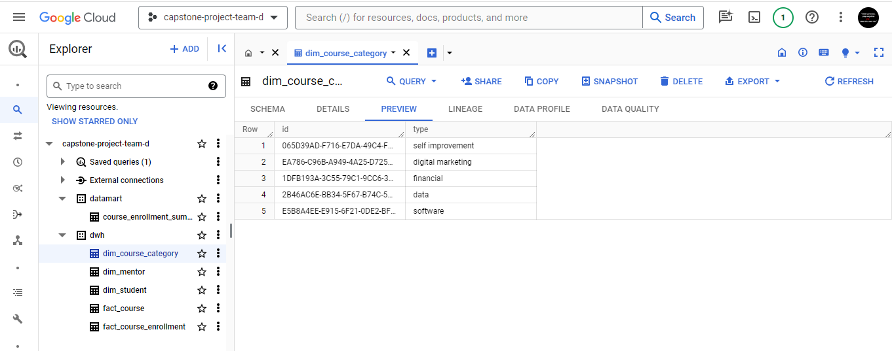

### 1. Buat direktori data dan direktori direktori lain di dalamnya
```
mkdir data
mkdir data/datamart_config
mkdir data/datamart_config/course_enrollment_summary
mkdir data/dwh_config
mkdir data/dwh_config/from_db
mkdir data/dwh_config/from_file
mkdir data/src
```

### 2. Masukkan data source ke direktori src


### 3. Buat script [etl_to_dwh.py](data/etl_to_dwh.py) dan [etl_to_datamart.py](data/etl_to_datamart.py)

Script ```etl_to_dwh.py``` digunakan untuk membuat fungsi yang dapat digunakan kembali (reusable) untuk berbagai format file. Di dalam script tersebut terdapat fungsi ```extract(path, format), extract_from_pg() dan load_to_bq(df, table_id, schema)``` yang bisa dijalankan dengan mengimport fungsi ```main``` atau ```main_2```.

```
def main(path, format, table_id, schema):
    df = extract(path, format)
    load_to_bq(df, table_id, schema)

def main_2(table_id, schema):
    df = extract_from_pg()
    load_to_bq(df, table_id, schema)
```

Sama seperti ```etl_to_dwh.py``` , script ```etl_to_datamart.py``` dibuat agar fungsi di dalamnya bisa digunakan kembali jika ingin membuat table datamart lainnya. Di dalam ```etl_to_datamart.py``` terdapat fungsi ```run_query(query, credentials)``` dan ```create_datamart_table(df, credentials, dataset, table_id, schema)``` yang bisa digunakan dengan mengimport fungsi ```main```
```
def main(query, dataset, table_id, schema):
    conn = Connection.get_connection_from_secrets(conn_id='to_bq')
    credentials = service_account.Credentials.from_service_account_info(json.loads(conn.extra_dejson['keyfile_dict']))
    credentials = credentials.with_scopes(["https://www.googleapis.com/auth/cloud-platform"])
    
    df = run_query(query, credentials)
    create_datamart_table(df, credentials, dataset, table_id, schema)
```

### 4. Buat file dengan extensi .yaml untuk menyimpan konfigurasi yang dibutuhkan oleh fungsi - fungsi yang dibuat sebelumnya dan file .sql untuk membuat query yang dibutuhkan untuk membuat table di datamart

Untuk data-source yang berasal dari file di local, bisa membuat file .yaml dengan format nama ```[format file]_[nomor file].yaml```. Lalu di dalamnya di input parameter yang dibutuhkan. File-file tersebut dimasukkan kedalam direktoti ```data/dwh_config/from_file/[nama_file].yaml```.

Contoh [```data/dwh_config/from_file/csv_1.yaml```](data/dwh_config/from_file/csv_1.yaml)

```
file_name: 'mentor.csv'
format: 'csv'
table_id: 'dim_mentor'
schema: [
  {'name': 'id', 'type': 'STRING', 'mode': 'REQUIRED'},
  {'name': 'first_name', 'type': 'STRING'},
  {'name': 'last_name', 'type': 'STRING'}
]
```

Sedangkan ntuk data-source yang berasal dari database postgres, dimasukkan ke dalam direktori ```data/dwh_config/from_db/[nama_file].yaml```.

Contoh ```data/dwh_config/from_db/db.yaml```. Jika ada dua file bisa menambahkan ```db_2.yaml```, dsb. File yaml tersebut berisi parameter yang dibutuhkan pada fungsi yang dibuat sebelumnya.

```
table_id: 'fact_course_enrollment'
schema: [
  {'name': 'student_id', 'type': 'STRING', 'mode': 'REQUIRED'},
  {'name': 'course_id', 'type': 'STRING', 'mode': 'REQUIRED'}
]
```

Untuk konfigurasi atau parameter yang dibutuhkan di script ```etl_to_datamart.py```, perlu membuat tambahan file .sql untuk mendefinisikan query, karena table datamart berasal dari table-table di dwh. File .yaml dan .sql dimasukkan ke dalam direktori ```data/datamart_config/[nama_table_datamart]/[nama_file]```. Format untuk nama file nya adalah ```config.yaml``` dan ```query.sql```, sedangkan untuk nama direktorinya disesuaikan dengan nama table yang akan dibuat di datamart.
Contoh

```
data/datamart_config/course_enrollment_summary/config.yaml
data/datamart_config/course_enrollment_summary/query.yaml
```
untuk file lengkapnya bisa dilihat pada [config](data/datamart_config/course_enrollment_summary/config.yaml) dan [query](data/datamart_config/course_enrollment_summary/query.yaml).

### 5. Running Airflow in Docker

Untuk memulai airflow bisa melihat dokumentasi [Running Airflow in Docker](https://airflow.apache.org/docs/apache-airflow/stable/howto/docker-compose/index.html)

Pertama, fetch docker-compose.yaml
```
curl -LfO 'https://airflow.apache.org/docs/apache-airflow/2.8.0/docker-compose.yaml'
```


Lalu buat folder-folder yang dibutuhkan airflow
```
mkdir -p ./dags ./logs ./plugins ./config
echo -e "AIRFLOW_UID=$(id -u)" > .env
```
Set ```AIRFLOW_UID```
```
AIRFLOW_UID=50000
```
Selanjutnya inisialisasi database
```
docker compose up airflow-init
```
Akan muncul pesan berikut setelah inisialisasi


### 6. Modify docker compose sesuai kebutuhan

Pada [docker-compose.yaml](docker-compose.yaml) bagian volumes di line 72, tambahkan ```${AIRFLOW_PROJ_DIR:-.}/data:/opt/airflow/data```

TIPS: ```AIRFLOW__CORE__LOAD_EXAMPLES``` pada line 62 set ke ```'false'``` agar example DAG ariflow tidak muncul.

### 7. Buat script DAG

Buat 2 script DAG pada direktori dags yang telah dibuat sebelumnya. Satu untuk task ke dwh dan satu lagi untuk task ke datamart

DAG pada script tersebut dapat disesuaikan start_date dan schedulenya sesuai kebutuhan
```
with DAG (
    'dag_etl_to_dwh',
    description='ETL to dataset dwh in Bigquery',
    schedule_interval='0 1 * * *',
    start_date=datetime(2024, 1, 8),
    # catchup=False
) as dag:
```
```
with DAG (
    'dag_etl_to_datamart',
    description='Create datamart from dwh in BigQuery',
    schedule_interval='0 2 * * *',
    start_date=datetime(2024, 1, 8),
    # catchup=False
) as dag:
```
Script lengkapnya bisa dilihat di [dag_etl_to_dwh.py](dags/dag_etl_to_dwh.py) dan [dag_etl_to_datamart.py](dags/dag_etl_to_datamart.py)

### 8. Jalankan docker compose
```
docker compose up -d
```
lalu buka ```localhost:8080``` untuk mengakses airflow. 
```
Username: airflow
Password: airflow
```


### 9. Set connection pada airflow

Buka ```Admin >> Connecitons``` pada UI airflow, lalu tambah connection. Pada project ini terdapat 2 connections, yaitu ```to_bq``` untuk koneksi ke bigquery dan ```pg_conn``` untuk koneksi ke database postgres.



### 10. Jalankan DAG 
TIPS: biarkan DAG running sesuai jadwal. jangan jalankan DAG secara manual agar ExternalTaskSensor bisa aktif secara otomatis.

Pertama, aktifkan DAG ```dag_etl_to_dwh``` dan tunggu sampai statusnya success. Setelah itu aktifkan DAG ```dag_etl_to_datamart``` dan secara otomatis ExternalTaskSensor akan running karena status task pada DAG ```dag_etl_to_dwh``` sudah success, sesuai dengan yang diinput pada script dag_etl_to_datamart, ```allowed_states=['success']```
```
task_wait_ext_task = ExternalTaskSensor(
    task_id=f"wait_{ext_task_depen['dag_id']}_{ext_task_depen['task_id']}",
    external_dag_id=ext_task_depen['dag_id'],
    external_task_id=ext_task_depen['task_id'],
    allowed_states=['success'],
    execution_delta=timedelta(minutes=ext_task_depen['minutes_delta'])
                )
```


### 11. Cek table di BigQuery

Dataset dwh


Dataset datamart


### 12. Buka Looker Studio untuk membuat visualisasi

Looker Studio dapat di akses melalui [```https://lookerstudio.google.com/```](https://lookerstudio.google.com/)

Buat laporan baru lalu import table ```course_enrollment_summary``` yang sudah di buat oleh task DAG sebelumnya di BigQuery


Buat grafik sesuai kebutuhan

Students per City


Top Mentor


Students per Course Category


### 13. Buat git ignore
Buat file .gitignore agar file atau folder yang tidak diinginkan tidak terpush ke github


